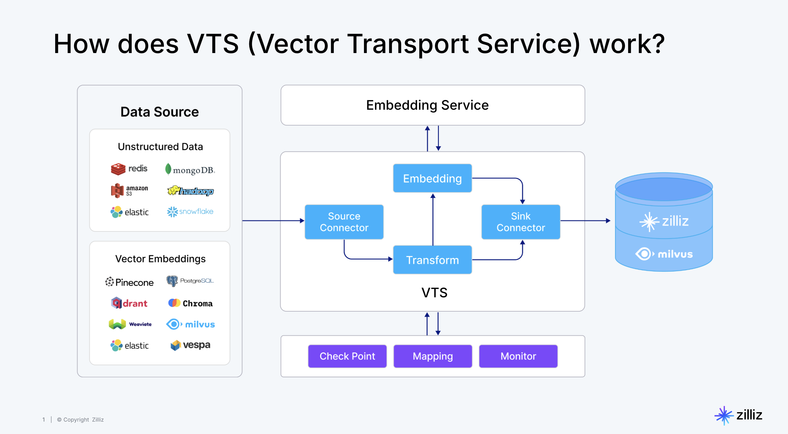
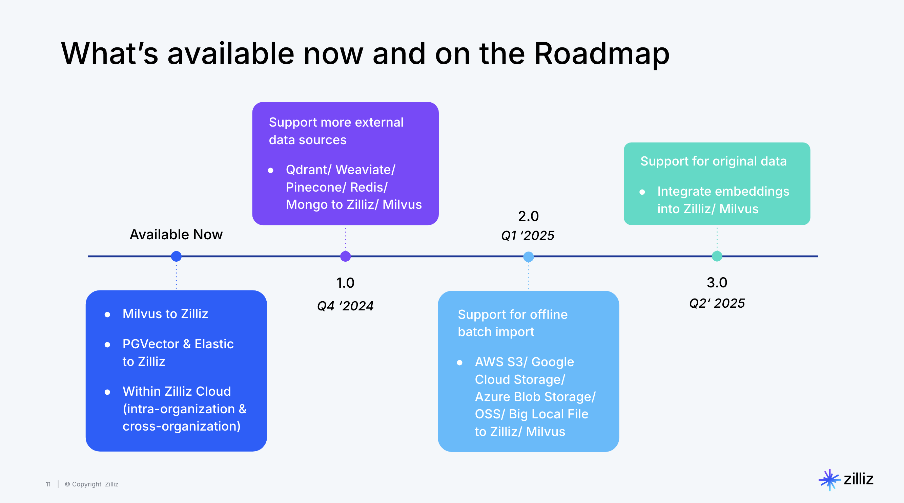

# VTS
[](https://discord.com/invite/mKc3R95yE5)
[](https://x.com/zilliz_universe)
[](https://x.com/milvusio)
## Overview
**VTS** (short for Vector Transport Service) is an open-source tool for moving [vectors](https://zilliz.com/glossary/vector-embeddings) and [unstructured data](https://zilliz.com/learn/introduction-to-unstructured-data). It is developed **by** [Zilliz](https://zilliz.com/) based on **Apache Seatunnel**.



## Why do you need a vector and unstructured data moving tool?
1. **Meeting the Growing Data Migration Needs:** VTS evolves from our Milvus Migration Service, which has successfully helped over 100 organizations migrate data between [Milvus](https://github.com/milvus-io/milvus) clusters. User demands have grown to include migrations from different [vector databases](https://zilliz.com/learn/what-is-vector-database), traditional search engines like [Elasticsearch](https://zilliz.com/comparison/milvus-vs-elastic) and Solr, [relational databases](https://zilliz.com/blog/relational-databases-vs-vector-databases), data warehouses, document databases, and even S3 and data lakes to Milvus.
2. **Supporting Real-time Data Streaming and Offline Import:** As vector database capabilities expand, users require both real-time data streaming and offline batch import options.
3. **Simplifying Unstructured Data Transformation:** Unlike traditional ETL, transforming unstructured data requires AI and model capabilities. VTS, in conjunction with the [Zilliz Cloud Pipelines](https://zilliz.com/zilliz-cloud-pipelines), enables vector embedding, tagging, and complex transformations, significantly reducing data cleaning costs and operational complexity.
4. **Ensuring End-to-End Data Quality:** Data integration and synchronization processes are prone to data loss and inconsistencies. VTS addresses these critical data quality concerns with robust monitoring and alerting mechanisms.

## Core Capabilities of VTS
Built on top of Apache Seatunnel, Vector-Transport-Service offers:
1. Rich, extensible connectors
2. Unified stream and batch processing for real-time synchronization and offline batch imports
3. Distributed snapshot support for data consistency
4. High performance, low latency, and scalability
5. Real-time monitoring and visual management

Additionally, Vector-Transport-Service introduces vector-specific capabilities such as multiple data source support, schema matching, and basic data validation. 


## Roadmap
Future roadmaps include incremental sync, combined one-time migration and change data capture, and more advanced data transformation capabilities.



To learn more details about VTS used in action, read our blog: 
- [**Introducing Migration Services: Efficiently Move Unstructured Data Across Platforms.**](https://zilliz.com/blog/zilliz-introduces-migration-services)

## Get Started
To get started with VTS, follow the [QuickStart Guide](#quickstart-guide).

### QuickStart Guide
This guide will help you get started with how to use vts to transport vector data into milvus, currently, we support the following source connectors:
- milvus
- postgres vector
- elastic search
- pinecone
- qdrant
- tencent vectordb

#### Step 1: Download VTS Image
```shell
docker pull zilliz/vector-transport-service:latest
docker run -it zilliz/vector-transport-service:latest /bin/bash
```
#### Step 2: Configure the Migration
Create a configuration file named milvus_to_milvus.conf with the following structure:
```shell
vim milvus_to_milvus.conf
```
```yaml
env {
  parallelism = 1
  job.mode = "BATCH"
}

source {
  Milvus {
  url="https://in01-***.aws-us-west-2.vectordb.zillizcloud.com:19530"
  token="***"
  database="default"
  collections=["medium_articles"]
  batch_size=100
  }
}

sink {
  Milvus {
  url="https://in01-***.aws-us-west-2.vectordb.zillizcloud.com:19542"
  token="***"
  database="default"
  batch_size=10
  }
}
```
Configuration Notes:

Replace placeholder values (marked with your-*) with your actual credentials
Adjust batch_size based on your data volume and system resources
The parallelism value can be increased for better performance on larger datasets

#### Step 3: Run the Migration
Execute the migration using the SeaTunnel shell script:

_Cluster Mode (Recommended)_
- Start the SeaTunnel cluster:
```shell
mkdir -p ./logs
./bin/seatunnel-cluster.sh -d
```
- Submit the migration job:

```shell
./bin/seatunnel.sh --config ./milvus_to_milvus.conf
```
_Local Mode_
```shell
./bin/seatunnel.sh --config ./milvus_to_milvus.conf -m local
```


#### Monitoring and Troubleshooting

Check the console output for progress and any error messages

### Next Steps

Verify data integrity in Milvus after migration. If Need help with specific configuration options or running into issues? Feel free to ask for clarification!

### Docker Deployment
VTS can also be deployed using Docker. To deploy VTS using Docker, follow the instructions in the [Docker Deployment Guide](./docs/zilliz/Docker%20Deployment.md).

```shell
docker pull zilliz/vector-transport-service:latest
```
## Tutorial
In addition to the quick start guide, vts has much more powerful features like
- lots of transformer to support TabelPathMapper, FieldMapper, Embedding etc.
- cluster mode ready for production use with restful api to manage the job
- docker deploy, etc.

For detailed information, please refer to [Tutorial.md](./Tutorial.md)

### Connectors
VTS supports a variety of connectors to move data between different systems.

Find Detailed documentation for each connector:
 - [Milvus](docs/zilliz/Milvus.md)
 - [Elasitc Search](docs/zilliz/Elastic%20Search.md)
 - [Pinecone](docs/zilliz/Pinecone.md)
 - [Qdrant](docs/zilliz/Qdrant.md)
 - [Postgres Vector](docs/zilliz/Postgres%20Vector.md)
 - [Tencent VectorDB](docs/zilliz/Tencent%20VectorDB.md)

### Development
see [Development.md](./Development.md) for building from source code and running examples.

## Support
If you require any assistance or have questions regarding VTS, please feel free to reach out to our support team: Email: support@zilliz.com

## About Apache Seatunnel
SeaTunnel is a next-generation, high-performance, distributed data integration tool, capable of synchronizing vast amounts of data daily. It's trusted by numerous companies for its efficiency and stability.
It's released under [Apache 2 License](https://github.com/apache/seatunnel/blob/dev/LICENSE).

SeaTunnel is a top-level project of the Apache Software Foundation (ASF). For more information, visit the [Apache Seatunnel website](https://seatunnel.apache.org/).
